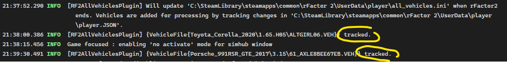
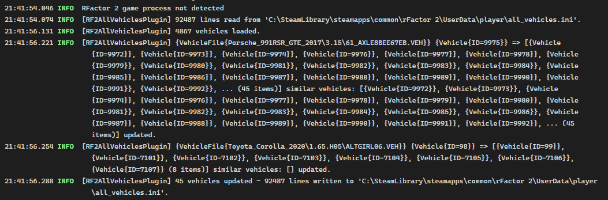

# rF2AllVehicles.Plugin

SimHub plugin to use last driven car to preserve seat, mirror, and FFB multipler settings, for all other cars of same kind.

## Background

Adjusting _seat_, _mirrors_ and/or _FFB multiplier_ is only saved for the current vehicle/livery combination by rFactor 2. I.e. when selecting the
same car but a different livery one need to adjust the seat, mirrors and FFB once again.

## Solution

The plugin monitor the last driven car and apply/copy settings to all other cars of the same type into the `all_vehicles.ini` file. This copy
must take place when rFactor 2 is not running, therefore settings are not copied until rFactor 2 is closed.

Cars are identified by its name and version inside `all_vehicles.ini` and matched against the last driven car in `playar.JSON`. We currently
ignore the _version_ effectivly ensuring settings for _all_ cars of same type is preserved/updated. 

The plugin reports the workings in SimHub's system log:

Selected cars are tracked:

And settings copied when rFactor 2 is closed:

## Installation

Copy DLL from rlease into SimHub installation folder. SimHub should pick up the plugin automatically.

### Backups

Backups, 10 of them rotating, of `all_vehicles.ini` is created when/if the file is updated. The backup number is appended to the end. 

## Issues

Please report issues on github, https://github.com/mattno/rF2AllVehicles.Plugin/issues.
